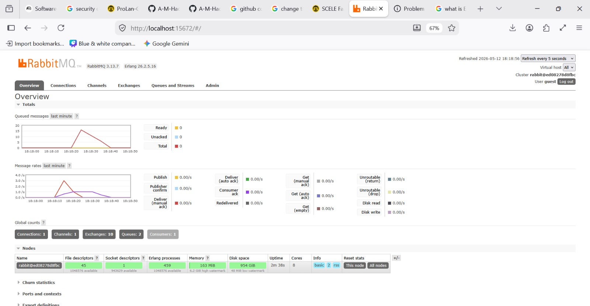

# Answer to Modul Questions

## a. What is AMQP?

**AMQP** stands for **Advanced Message Queuing Protocol**. It is an open-standard application layer protocol for message-oriented middleware that enables different systems and applications to communicate with each other regardless of their platforms.

In the context of this tutorial's broker topology, AMQP is significant because it supports features like programmatic load balancing and monitoring. It achieves this through a distinct separation between an exchange (where the publisher sends data) and a queue (where the subscriber listens for data).

## b. What does `guest:guest@localhost:5672` mean?

This string is a connection URL used by the publisher and subscriber to communicate with the RabbitMQ message broker. It breaks down as follows:

- `amqp://`: This specifies the protocol being used for the connection (Advanced Message Queuing Protocol).
- The first `guest`: This is the username required to authenticate with the RabbitMQ server.
- The second `guest`: This is the password associated with that username.
- `localhost`: This is the network address (host) where the message broker is running. In this tutorial, it refers to your own machine (or the Docker container mapped to it).
- `5672`: This is the specific port number that the RabbitMQ message broker listens on for incoming connections from programs.

_(Note: While port `5672` is for the message broker itself, port `15672` is used separately for the web-based management dashboard.)_

## Answer for Slow Subscriber Commit

### Analysis of Queued Messages

The presence of 15 messages in the queue is a direct consequence of running the publisher program three times in quick succession while the subscriber was slowed down. According to the tutorial's logic, each individual run of the publisher sends exactly 5 events (for users Amir, Budi, Cica, Dira, and Emir) to the message broker. Because the subscriber's code was modified to include a 1-second delay (`thread::sleep`) for every message it handles, it can no longer process events at the same speed they are being produced.

As the publisher finishes its three runs almost instantly, it "fires and forgets" a total of 15 events into the `user_created` channel. The RabbitMQ broker then stores these pending events in a queue, which acts as a back pressure point to prevent the slow subscriber from being overwhelmed or causing a system crash. This build-up demonstrates a core benefit of event-driven architecture: the system remains responsive because the producer does not have to wait for the consumer to finish, allowing the broker to buffer the workload. Consequently, the subscriber will slowly process each of the 15 messages one by one until the queue is eventually cleared.
